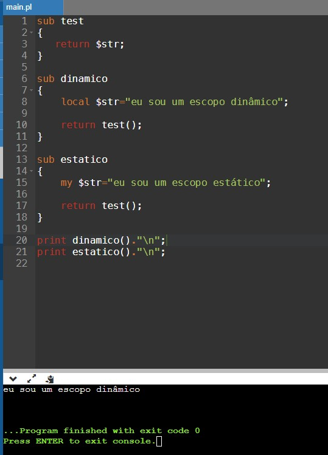

## Escopo Estático e Dinâmico em Perl
Compilado no [OnlineGDB](https://www.onlinegdb.com/).

Código usando ambos tipos de escopos, estático e dinâmico:

```Perl
sub test 
{ 
   return $str; 
}

sub dinamico
{
    local $str="eu sou um escopo dinâmico";
    
    return test();
}

sub estatico
{
    my $str="eu sou um escopo estático";
    
    return test();
}

print dinamico()."\n";
print estatico()."\n";
``` 
Em Perl, o `local` define uma variável local com escopo dinâmico e o `my` variáveis com escopo estático.
No código, são criadas duas funções, uma para cada tipo de escopo, e uma função teste que retorna o valor da variável sem recebê-la. Como o esperado, o programa conseguiu imprimir apenas o escopo dinâmico, pois o estático não consegue retornar nenhum valor quando se chama a função teste.



Assim, relacionando os resultados obtidos com o estudo de escopos desenvolvidos, vemos que no escopo dinâmico de Perl, os subprogramas de uma função tem acesso a uma variável, mesmo que ela não seja passada como parâmetro e, no escopo estático de Perl, os subprogramas não tem acesso a variável a menos que ela seja passada como parâmetro, ou seja, Perl não permite que eles sejam aninhados.


