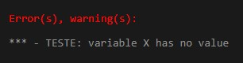

## Escopo Estático e Dinâmico em COMMON LISP

O código foi compilado usando a ferramenta online que pode ser acessada por [aqui](https://rextester.com/l/common_lisp_online_compiler)


### Escopo estático
Um exemplo de código com escopo estático em COMMON LISP:

```Lisp
(defun estatico (x)
  (print x)
  (teste))

(defun teste ()
  (print x))

(estatico 5)
``` 
Nesse caso, a variável x, que quando a função é chamada recebe o valor 5, é declarada em uma função estaticamente, isso significa que o método `teste`, quando chamado na função `estatico`, não tem acesso a variável x que foi passada para o método `estatico`.

No primeiro teste, compilou-se o programa da mesma maneira que foi apresentada acima, a mensagem de erro que foi imprimida foi a seguinte:



Na segunda tentativa, retirou-se a chamada da função teste na função estatico e o número 5 foi imprimido na tela, o que permite concluir que a função estatico tem acesso a variável passada na chamada da função, mas a função teste não consegue ver essa variável. Esse comportamento era esperado, já que a função foi declarada estaticamente e a função teste não recebe explicitamente a variável x.

### Escopo dinâmico
Testando um exemplo semelhante, mas com escopo dinâmico em COMMON LISP:

```Lisp
(defvar x)

(defun dinamico (x)
  (print x)
  (teste))

(defun teste ()
  (print x))

(dinamico 5)
``` 
Nesse caso, a variável x foi declarada com `defvar`, e, por causa disso, todos os usos dessa variável agora são de vinculação dinâmica, o que significa que a função teste terá acesso a variável 5 passada pela chamada da função dinamico.
Como o esperado, o resultado apresentado na tela foi o seguinte:


O primeiro 5 é o print presente na função dinamico, e o segundo é o print da função teste, que agora consegue imprimir o valor 5, devido variável x ter sido declarada de forma dinâmica.
