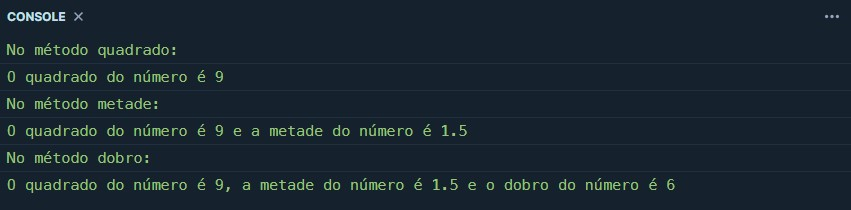

## Subprogramas aninhados JavaScript
Nesse caso, para que as variáveis fossem criadas dinamicamente para que os subprogramas tivessem acesso, foi necessário utilizar o método `window`. O compilador online que aceitou este método, e que, por isso, foi utilizado nesse projeto foi o [playcode](https://playcode.io/javascript).

O código compilado foi o seguinte:

```JavaScript
function quadrado(numero) {

    const varName="quadradon"
    window[varName]=numero * numero;
    console.log("No método quadrado: ");
    console.log("O quadrado do número é "+quadradon); 
    
    metade(numero);
}

function metade(numero)
{
    const varName2="metaden"
    window[varName2]=numero/2;
    console.log("No método metade: ");
    console.log("O quadrado do número é "+quadradon+" e a metade do número é "+metaden);
    dobro(numero);
}

function dobro(numero)
{
    var dobro=numero*2;
    console.log("No método dobro: ");
    console.log("O quadrado do número é "+quadradon+", a metade do número é "+metaden+" e o dobro do número é "+dobro);
}

quadrado(3);
```

As funções são aninhadas em 3 níveis, sendo `quadrado` o primeiro, `metade`o segundo e `dobro` o terceiro.
Como dito anteriormente, para que os subprogramas tivessem acesso as váriaveis dos programas superiores, foi utilizado o `window`.
O programa é bem simples e tem função de calcular o quadrado, a metade e o dobro de um número passado. No exemplo de compilação, o número passado foi o 3 e o resultado obtido no console foi:



