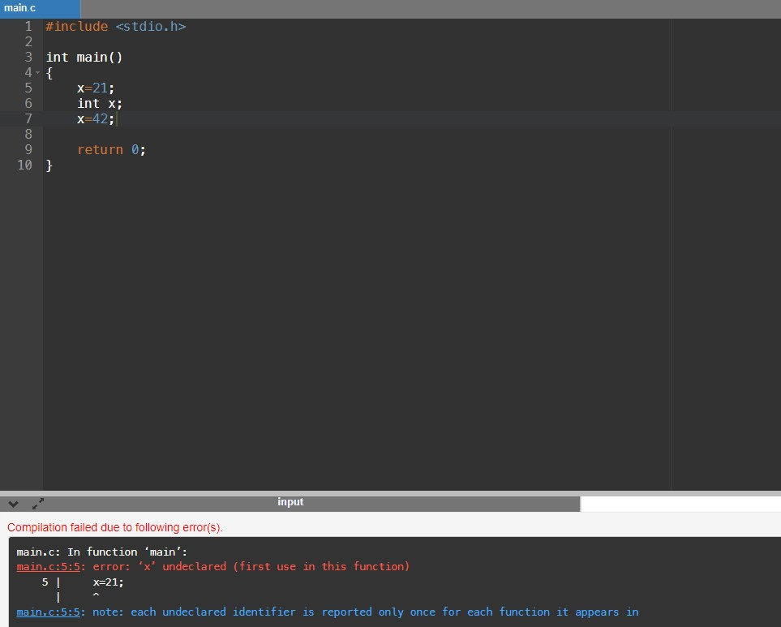
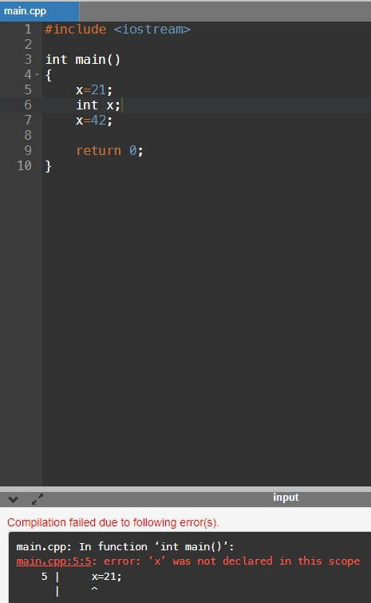

Compilado no [OnlineGDB](https://www.onlinegdb.com/).

## C

```C
#include <stdio.h>

int main()
{
    x=21;
    int x;
    x=42;
    
    return 0;
}

```

O C não permitiu a execução, exibindo o seguinte erro na linha onde x é atribuído a 21:

`main.cpp:5:5: error: ‘x’ undeclared (first use in this function)`



## C++

```C++
#include <iostream>

int main()
{
    x=21;
    int x;
    x=42;
    
    return 0;
}
```

O C++ também não permitiu a execução, exibindo o mesmo erro que o C na linha onde x é atribuído a 21:

`main.cpp:5:5: error: ‘x’ was not declared in this scope`




## Java

```Java
public class Main
{
    public static void main()
    {
        x=21;
        int x;
        x=42;
    }
}
```

O Java também não permitiu a execução, exibindo o mesmo erro que o C na linha onde x é atribuído a 21:

`Main.java:3: error: cannot find symbol`
`symbol: variable x`
`location: class Main`


O error tem o mesmo significado dos erros das linguagens acima, apenas se apresenta de forma diferente. O compilador não conseguiu achar a variável x na classe main antes da linha da atribução porque ela só foi declarada depois.

## Conclusão

Pode-se concluir que em todas as três linguagens, uma variável deve ser declarada antes de ser manipulada. Esse comportamento já era esperado pelo fato de todas as três linguagens serem fortemente tipadas.
