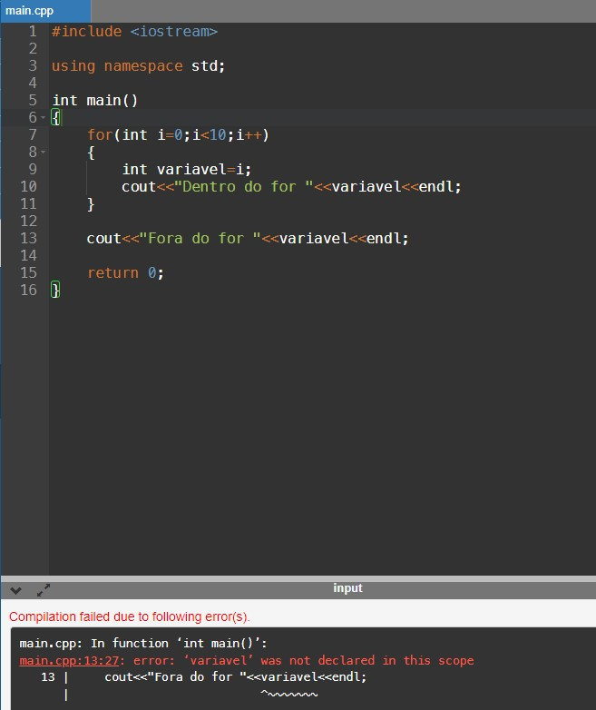
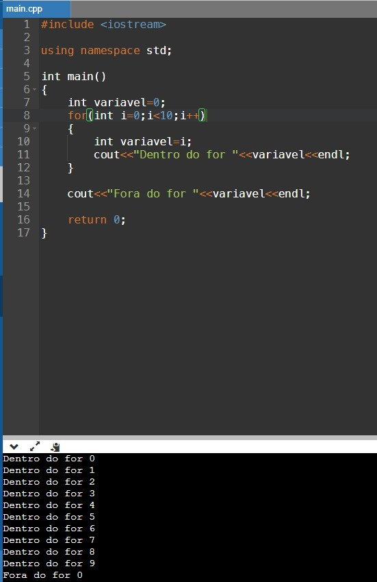
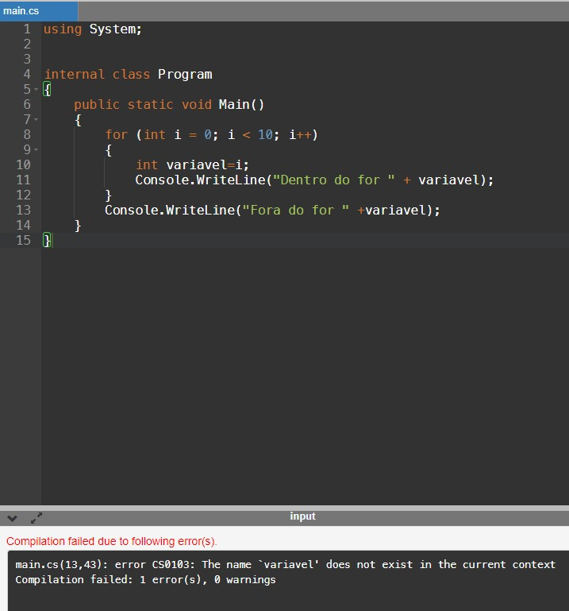
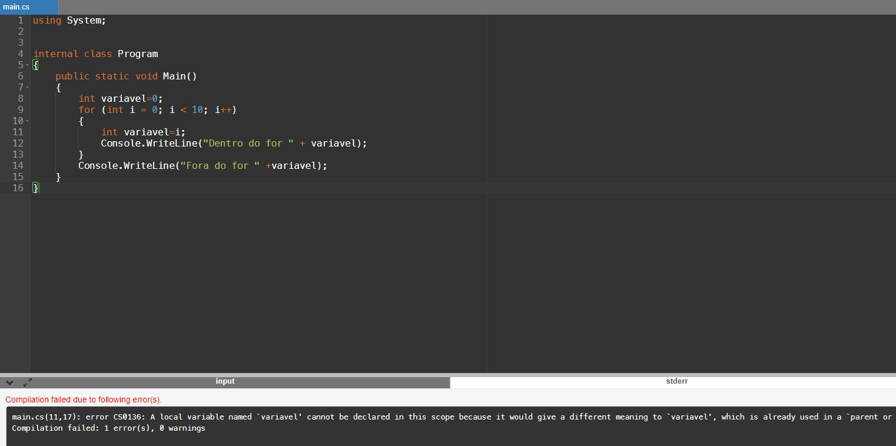
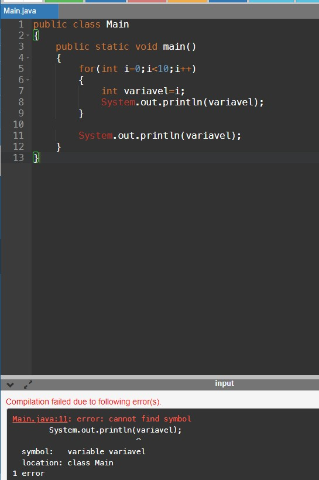
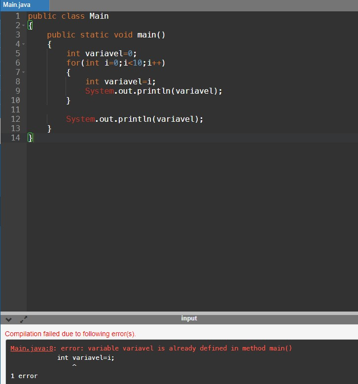

Compilado no [OnlineGDB](https://www.onlinegdb.com/).

<h2> C++ </h2>

A tentativa de execução foi feita no seguinte código:

``` C++
#include <iostream>

using namespace std;

int main()
{
    for(int i=0;i<10;i++)
    {
        int variavel=i;
        cout<<"Dentro do for "<<variavel<<endl;
    }
    
    cout<<"Fora do for "<<variavel<<endl;
    
    return 0;
}
```
O C++ não permitiu a execução, exibindo o seguinte erro na linha do cout usado fora do for:

`main.cpp:13:27: error: ‘variavel’ was not declared in this scope`



O erro diz que a variavel local "variavel" não foi declarada no escopo em que a impressão dela foi solicitada.

Para tentar corrigir o erro, declarei a variável fora do for, com o mesmo nome e tentei executar novamente. O código se apresentou da seguinte maneira:


``` C++
#include <iostream>

using namespace std;

int main()
{
    int variavel=0;
    for(int i=0;i<10;i++)
    {
        int variavel=i;
        cout<<"Dentro do for "<<variavel<<endl;
    }
    
    cout<<"Fora do for "<<variavel<<endl;
    
    return 0;
}

```
O programa foi executado, porém a impressão do programa imprimiu no loop a variação do i, e fora do loop o 0. Isso significa que os valores da variável não foram salvos.



<h2> C# </h2>

A tentativa de execução foi feita no seguinte código:

``` C++
using System;


internal class Program
{
    public static void Main()
    {
        for (int i = 0; i < 10; i++)
        {
            int variavel=i;
            Console.WriteLine("Dentro do for " + variavel);
        }
        Console.WriteLine("Fora do for " +variavel);
    }
}
```
O C# não permitiu a execução, exibindo o erro:

`main.cs(13,43): error CS0103: The name 'variavel' does not exist in the current context`




O erro diz que a variavel local "variavel" não existe onde foi solicitado que ela fosse mostrada na tela, ou seja, fora do for.

Para tentar corrigir o erro, declarei a variável fora do for, com o mesmo nome e tentei executar novamente. O código se apresentou da seguinte maneira:


``` C++
using System;


internal class Program
{
    public static void Main()
    {
        int variavel=0;
        for (int i = 0; i < 10; i++)
        {
            int variavel=i;
            Console.WriteLine("Dentro do for " + variavel);
        }
        Console.WriteLine("Fora do for " +variavel);
    }
}
```
O C# também não permitiu a execução desse programa, exibindo o erro:

`main.cs(11,17): error CS0136: A local variable named 'variavel' cannot be declared in this scope because it would give a different meaning to 'variavel', which is already used in a 'parent or current' scope to denote something else`



O erro diz que a variavel local "variavel" não pode ser declada no for porque ela já foi criada em um escopo pai para definir outra coisa.

<h2> Java </h2>

A tentativa de execução foi feita no seguinte código:

``` Java
public class Main
{
    public static void main()
    {
        for(int i=0;i<10;i++)
        {
            int variavel=i;
            System.out.println(variavel);
        }
    
        System.out.println(variavel);
    }
}

```
O Java também não permitiu a execução, exibindo o seguinte erro na linha do System.out.println() usado fora do for:

`Main.java:11: error: cannot find symbol`
`symbol: variable variavel`
`location: class Main`



O erro diz que a variavel local "variavel" não foi encontrada na classe main.

Para tentar corrigir o erro, declarei a variável fora do for, com o mesmo nome e tentei executar novamente. O código se apresentou da seguinte maneira:


``` Java
public class Main
{
    public static void main()
    {
        int variavel=0;
        for(int i=0;i<10;i++)
        {
            int variavel=i;
            System.out.println(variavel);
        }
    
        System.out.println(variavel);
    }
}
```
Nesse caso, o programa apresentou o seguinte erro:

`Main.java:8: error: variable variavel is already defined in method main()`



Que diz que a variável ja foi definida no método main, e por isso não pode ser definida novamente dentro do for.


## Conclusão
Em todos os casos, quando se colocava a impressão do valor da variável apenas dentro do for, o programa era executado perfeitamente.

Conclui-se que em todas as três linguagens (C++,Java e C#), uma variável declarada dentro do for pode ser manipulada e vista, ou seja, tem seu escopo, apenas no próprio for. Esse comportamento era esperado, por serem linguagens que permitem apenas escopos estáticos. Porém, na linguagem C++, consegue-se declarar duplamente, dentro e fora do for, com uma observação que uma mudança feita dentro do for só é válida dentro do próprio for.